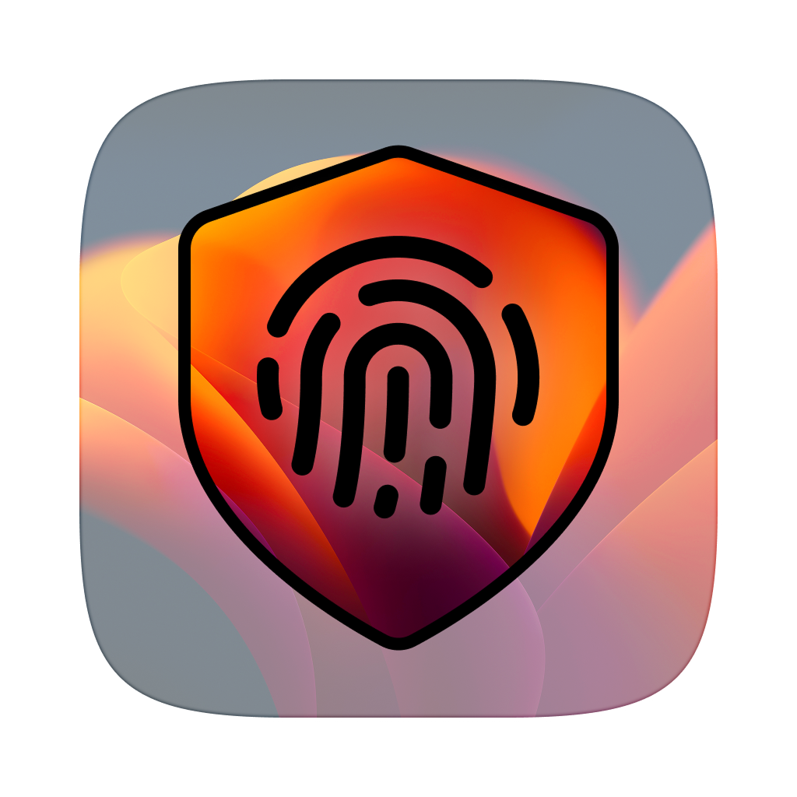

<div>
<h3 style="font-size: 2.5rem; letter-spacing: 1px;">Sentry</h3>
<p style="font-size: 1.15rem; font-weight: 500;">
    <strong>Secure your workflow without stopping it.</strong><br>
    Sentry allows you to "lock" your Mac effectively—preventing unauthorized access with a Kiosk-style shield—while keeping the system technically unlocked. This ensures that long-running tasks like <strong>compiling code, downloading large files, or rendering video</strong> continue uninterrupted in the background, which would otherwise be paused by the native macOS sleep/lock.
  </p>

<br/><br/>

<div align="center">

[](LICENSE)
  [](https://github.com/monuk7735/sentry/releases)
  [](https://github.com/monuk7735/sentry/issues)
  [](https://github.com/monuk7735/sentry/pulls)
  [](https://www.apple.com/macos/)

<br/>

<a href="https://github.com/monuk7735/sentry/releases"></a>

<br/>

<br/>

</div>

<hr>

## Features

- **Prevent Sleep** - Keeps your Mac awake and active (disables idle sleep) while locked, ensuring background tasks continue uninterrupted.
- **Caffeine Mode** - Toggle "Caffeine Mode" to keep your Mac awake even when not locked.
- **Kiosk-Style Security** - Hides the Dock, Menu Bar, and disables process switching (`Cmd+Tab`) while locked to prevent unauthorized access.
- **Biometric Unlock** - Integrated directly with **Touch ID** for seamless, fast unlocking.
- **Smart Fallback** - Detects when Touch ID is unavailable (e.g., Clamshell mode) and provides clear instructions to use standard system lock (`Cmd+Ctrl+Q`).
- **Multi-Display Support** - Automatically detects and covers all connected displays, including new connections while locked.
- **Visual Feedback** - Shake animations on interaction and smooth fade transitions.
- **Resilient Focus** - Aggressively maintains focus to prevent being bypassed by system shortcuts or other apps.
- **Menu Bar App** - Unobtrusive menu bar item for quick activation.
- **SwiftUI & AppKit** - built for modern macOS performance.

## Global Shortcuts

Sentry works silently in the background with global shortcuts:

| Shortcut | Description |
| :--- | :--- |
| **Cmd + Shift + L** | Activates **Sentry Lock**. |
| **Cmd + Shift + K** | Toggles **Caffeine Mode**. |

## Installation

### Homebrew

```bash
brew install --cask monuk7735/tap/sentry --no-quarantine
```

### Manual Download

1. Download the latest release from [GitHub Releases](https://github.com/monuk7735/sentry/releases).
2. Move the app to the Applications folder.
3. Run the app and grant necessary permissions if prompted.

### ⚠️ "Damaged" or "Unidentified Developer" Error?

> I don't have an Apple Developer account yet, so the application will display a popup on the first launch.

**Option 1 (Recommended): Allow via System Settings**

1. Open **System Settings** → **Privacy & Security**.
2. Scroll down to the **Security** section.
3. Look for "**Sentry** was blocked..." and click **Open Anyway**.
4. Click **Open** in the confirmation popup.

**Option 2 (Advanced): Run this command in Terminal**

```bash
xattr -cr /Applications/Sentry.app
```

This command simply removes the "quarantine" flag that macOS places on apps downloaded from the internet, resolving the false error.

- `xattr` : The utility to modify file attributes.
- `-c` : Clears all attributes (removes the "quarantine" flag).
- `-r` : Recursive (applies to all files inside the app bundle).

## Usage

1. Launch **Sentry**.
2. Lock your screen using the **Global Shortcut** `Cmd + Shift + L`, or click "Activate" in the menu bar.
3. Your screen is now vigilant! 
4. To toggle **Caffeine Mode** (keep system awake), use `Cmd + Shift + K`.
5. To unlock, simply use **Touch ID**.
   - If Touch ID is not available, the app will guide you to secure the system manually.

## Roadmap

- [x] ~~Implement Kiosk Mode (Sandboxed Input Capture).~~
- [x] ~~Multi-Display Support with dynamic connection handling.~~
- [x] ~~Touch ID Authentication.~~
- [x] ~~Smart focus stealing to prevent app switching.~~
- [x] ~~Touch ID Fallback UI.~~
- [x] ~~Global keyboard shortcut for activation.~~
- [ ] Intruder selfie capture (Future).
- [ ] Customizable lock screen backgrounds/widgets.

## Troubleshooting

**Touch ID not recognized?**
If Sentry fails to detect Touch ID or you are unable to unlock for any reason:
- Press **Command + Control + Q**.
- This will instantly trigger the native macOS system lock, securing your machine regardless of Sentry's state.

## Contributing

Contributions are welcome! Feel free to open issues or submit pull requests.

## License

This project is licensed under the [GPLv3 License](LICENSE).
