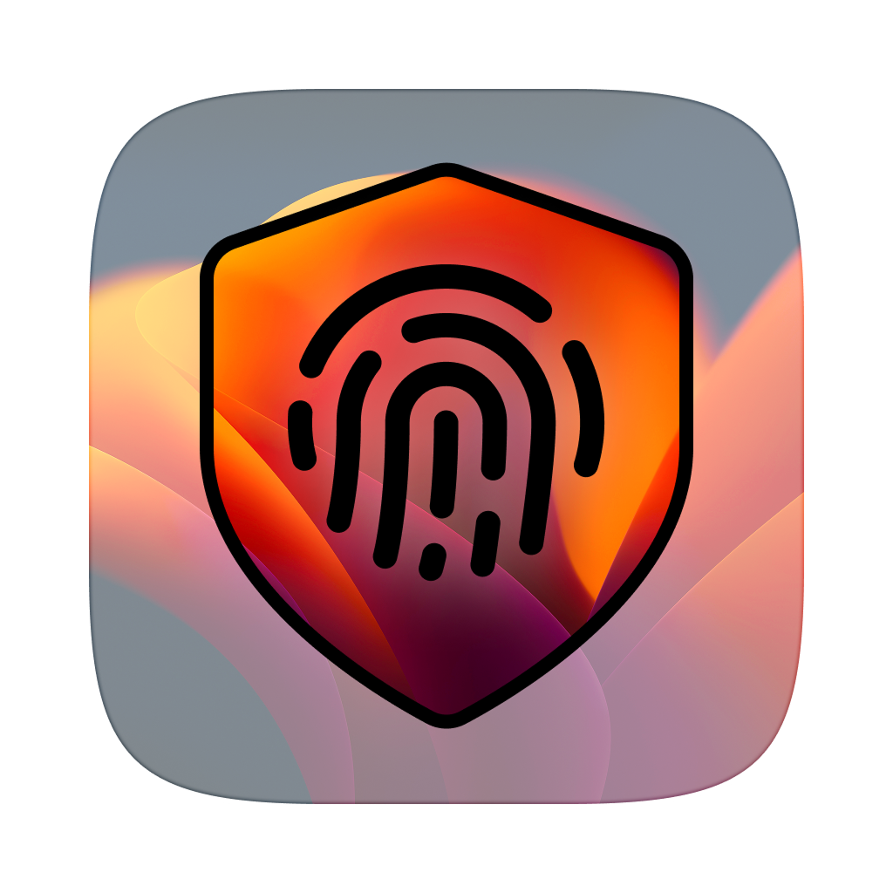
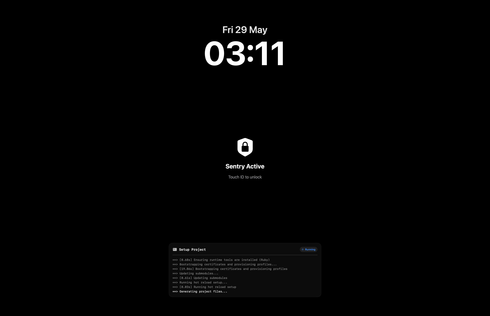

<div>
<h3 style="font-size: 2.5rem; letter-spacing: 1px;">Sentry</h3>
<p style="font-size: 1.15rem; font-weight: 500;">
    <strong>Secure your workflow without stopping it.</strong><br>
    Sentry allows you to "lock" your Mac effectively—preventing unauthorized access with a Kiosk-style shield—while keeping the system technically unlocked. This ensures that long-running tasks like <strong>compiling code, downloading large files, or rendering video</strong> continue uninterrupted in the background, which would otherwise be paused by native macOS sleep.
  </p>

<br/><br/>

<div align="center">

[](LICENSE)
  [](https://github.com/monuk7735/sentry/releases)
  [](https://github.com/monuk7735/sentry/issues)
  [](https://github.com/monuk7735/sentry/pulls)
  [](https://www.apple.com/macos/)

<br/>

<a href="https://github.com/monuk7735/sentry/releases"></a>

<br/>

<br/>

</div>

<hr>

## Features

- **Caffeine Mode & System Sleep Prevention** - Prevents display sleep and optionally disables system CPU sleep (`pmset -a disablesleep 1`) natively without `sudo` privileges, keeping your long-running tasks active.
- **Interactive Onboarding Welcome Guide** - Smooth 2-screen welcome flow showcasing core features with quick interactive setup buttons.
- **Redesigned Settings & Aesthetic UI** - Modern translucent window styling with compact category tabs, live toggles, and terminal code snippets.
- **Interactive Shortcut Recorder** - Record global hotkeys with live modifier key badges (`⌘`, `⌥`, `⌃`, `⇧`) and instant validation warnings.
- **Lock Screen Clock & Date** - Displays a modern, macOS-style clock and date widget on the lock screen overlay.
- **CLI Command Monitoring** - Pipe long-running logs and command outputs directly to the lock screen with the integrated `sentry-cli` companion.
- **Kiosk-Style Security** - Hides the Dock, Menu Bar, and disables process switching (`Cmd+Tab`) while locked to prevent unauthorized access.
- **Biometric Unlock** - Integrated directly with **Touch ID** for seamless, fast unlocking.
- **Smart Fallback** - Detects when Touch ID is unavailable (e.g., Clamshell mode) and provides clear instructions to use standard system lock (`Cmd+Ctrl+Q`).
- **Multi-Display Support** - Automatically detects and covers all connected displays, including new connections while locked.
- **Resilient Focus** - Aggressively maintains focus to prevent being bypassed by system shortcuts or other apps.
- **Menu Bar App** - Unobtrusive menu bar extra for instant access to lock screen, caffeine mode, and settings.
- **SwiftUI & AppKit** - Built natively for high performance on macOS.

## Global Shortcuts

Sentry works silently in the background with customizable global shortcuts. By default:

| Shortcut | Description |
| :--- | :--- |
| **Option + Shift + L** | Activates **Sentry Lock**. |
| **Option + Shift + K** | Toggles **Caffeine Mode**. |

> **Note:** You can easily record new custom shortcuts or reset defaults via Sentry's interactive shortcut recorder in Settings.

## CLI Integration

Sentry includes a lightweight command-line companion (`sentry-cli`) that allows piping logs, stdout, or running subcommands directly on your lock screen so you can monitor progress in real-time.

### Installation
Go to Sentry **Settings** → **CLI Tool** tab and click **Install CLI Tool** to link it to `/usr/local/bin/sentry-cli`.

### Examples
* **Pipe stdout of a command:**
  ```bash
  make build | sentry-cli --title "Build"
  ```
* **Run a command as a subcommand:**
  ```bash
  sentry-cli --title "Testing" -- npm test
  ```
* **Automatically clear progress when finished:**
  Pass the `-c` or `--clear` option:
  ```bash
  sentry-cli -c --title "Deploy" -- ./deploy.sh
  ```

## Installation

### Homebrew

```bash
brew install --cask monuk7735/tap/sentry
```

### Manual Download

1. Download the latest release from [GitHub Releases](https://github.com/monuk7735/sentry/releases).
2. Move the app to the Applications folder.
3. Run the app and grant necessary permissions if prompted.

### ⚠️ "Damaged" or "Unidentified Developer" Error?

> If macOS displays a security warning on the first launch:

**Option 1 (Recommended): Allow via System Settings**

1. Open **System Settings** → **Privacy & Security**.
2. Scroll down to the **Security** section.
3. Look for "**Sentry** was blocked..." and click **Open Anyway**.
4. Click **Open** in the confirmation popup.

**Option 2 (Advanced): Run this command in Terminal**

```bash
xattr -cr /Applications/Sentry.app
```

This command simply removes the "quarantine" flag that macOS places on apps downloaded from the internet.

## Usage

1. Launch **Sentry**.
2. Explore the interactive **Welcome Guide** to test core features.
3. Lock your screen using the **Global Shortcut** (`Option + Shift + L`) or click "Lock Screen" in the menu bar.
4. Toggle **Caffeine Mode** (`Option + Shift + K`) to prevent display & system sleep during long render/compile tasks.
5. To unlock, simply use **Touch ID**.

## Roadmap

- [x] ~~Implement Kiosk Mode (Sandboxed Input Capture).~~
- [x] ~~Multi-Display Support with dynamic connection handling.~~
- [x] ~~Touch ID Authentication.~~
- [x] ~~Global keyboard shortcut recording and live validation.~~
- [x] ~~Lock screen clock widget and command progress monitoring.~~
- [x] ~~Caffeine mode with system sleep prevention (`pmset -a disablesleep`).~~
- [x] ~~Interactive 2-screen onboarding welcome guide.~~
- [ ] Intruder selfie capture (Future).
- [ ] Customizable lock screen backgrounds.

## Troubleshooting

**Touch ID not recognized?**
If Sentry fails to detect Touch ID or you are unable to unlock for any reason:
- Press **Command + Control + Q**.
- This will instantly trigger the native macOS system lock, securing your machine regardless of Sentry's state.

## Contributing

Contributions are welcome! Feel free to open issues or submit pull requests.

## License

This project is licensed under the [GPLv3 License](LICENSE).
